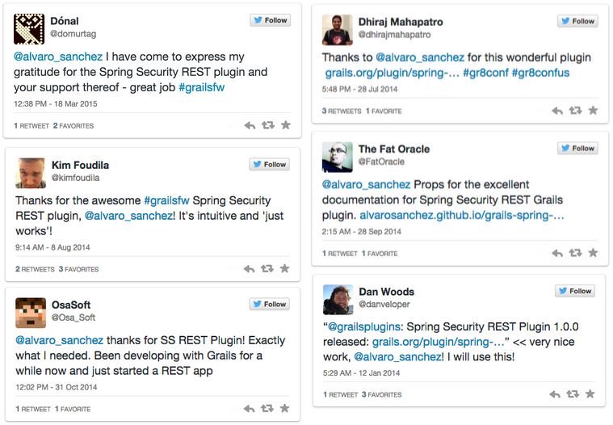

As this project is not an application, but a plugin to be used in other applications, it's hard to tell how much people
is using it. In my personal experience, the plugin was used in an authentication microservice which is already in
production.

I have spoken about the plugin in 7 conferences across 5 countries. In all of them I have found a bunch of thankful
users. Some of them have also expressed their gratitude publicly on Twitter:

Having a look at the statistics on GitHub, we can also conclude that it's a very successful project:

* 99 people starred the project.
* 66 have forked it.
* 22 have sent code contributions through 44 pull requests.
