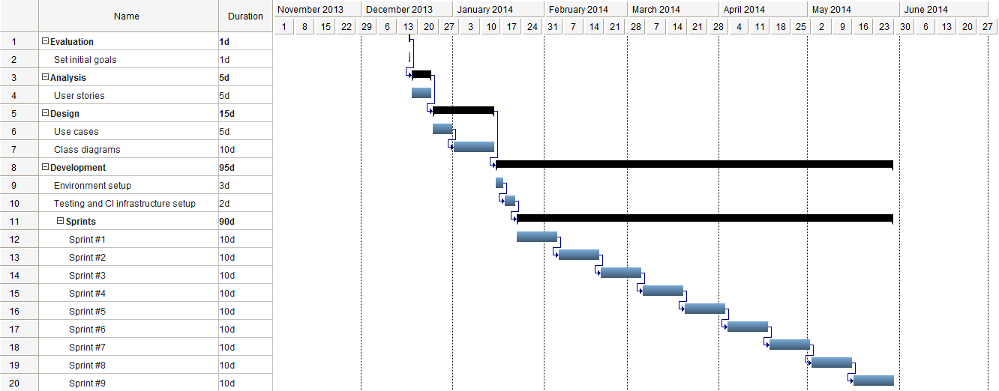

=== Planning

The initial Gantt diagram of the project is shown below:

.Initial Gantt diagram


<<<

=== Budget

This section analyses the different costs incurred while developing this project.
 
==== Human resources

To calculate the human resources cost, we are considering a cost of *296 € per day*. The breakdown of such amount is the
following:

* Annual salary of a senior developer with 10+ years of experience: 45,000 €.
* Company costs (social security, supplies): 22,000 €.
* Total cost: 67,000 €.

This information is coming from the personal experience of the author running a consulting company and understanding
the job market in Spain and the United Kingdom.

The maximum amount of working hours per year in Spain in the IT market is 1.808. That's 226 working days.
67,000 / 226 =~ 296 €.

.Human resources budget
[cols="^,^,>"]
[options="header,footer"]
|===
| *Phase* | *Duration (days)* | *Cost (€)*

| Evaluation
| 1
| 296.00 €

| Analysis
| 5
| 1,480.00 €

| Design
| 15
| 4,440.00 €

| Development
| 95
| 28,120.00 €

| *TOTAL*
| 119
| 35,224.00 €
|===

<<<

==== Equipment, servers and software licenses

The equipments costs accounted are considering depreciation and amortization, under the following formula:

```
Cost = A/B * C * D
```

Where:

* `A`: number of months elapsed since product is first purchased and used.
* `B`: depreciation period (36 months for equipments, 12 months for licenses).
* `C`: item cost.
* `D`: percentage usage dedicated to this project (usually 100%).

.Equipment, servers and software licenses budget
[cols="^,>"]
[options="header,footer"]
|===
| *Item* | *Cost (€)*

| MacBook Pro Retina 15 inches early 2013
| 333.33 €

| IntelliJ IDEA Personal License
| 66.33 €

| GitHub git hosting
| 0.00 €

| Travis CI
| 0.00 €

| *TOTAL*
| 399.66 €
|===

==== Summary

The total cost of this project has been estimated in *35,623.66 €*
